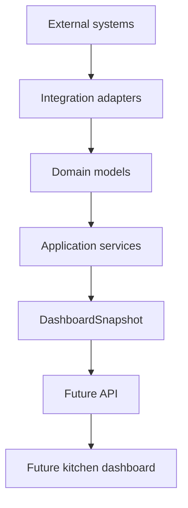

# Nuestra Casita Application Layer

## Purpose

The application layer turns backend-neutral integration output into household
experiences. It coordinates capabilities, validates domain record types, and
assembles the internal dashboard contract.

It exists separately from integrations so that:

- Backend adapters focus on transport and translation.
- Household workflows do not branch on vendor names.
- Multiple integrations can contribute without importing one another.
- Future API and UI layers receive stable application results.
- Integration failures can be isolated by capability.

The implementation lives in `casita.application`.

## Dependency Direction

Dependencies point toward lower-level contracts:

- Domain models import no integration or application code.
- Integration contracts depend on domain models.
- Application services depend on domain and integration contracts.
- Dashboard assembly depends on application services and the dashboard
  contract.
- Future transport depends on the application layer.

The application package imports no Grocy-specific module.

## Packages

### `application.coordination`

`IntegrationDirectory` is an instance-scoped collection of injected adapters.
It is not a singleton and does not perform package scanning.

It:

- Validates unique integration keys.
- Selects adapters by declared capability.
- Supports optional ordered ownership per capability.
- Allows all matching adapters to contribute when ownership is not configured.
- Sends a common `ReadRequest`.
- Combines normalized capability records.
- Converts adapter exceptions into non-fatal `IntegrationFailure` values.
- Validates snapshot integration and household identity.

Future adapters are registered by passing instances to the directory at the
composition root. No application service changes are required.

### `application.services`

Services are defined around household capabilities:

| Service | Domain output |
| --- | --- |
| `ShoppingService` | Shopping lists |
| `InventoryService` | Inventory projections |
| `RecipeService` | Recipes |
| `ChoreService` | Chores |
| `CalendarService` | Calendar events, including today's projection |
| `BudgetService` | Budget summaries |
| `NotificationService` | Notifications |
| `DeviceService` | Devices and normalized states |
| `MediaService` | Household media |

Each service uses the same generic `CapabilityService` behavior and verifies
that adapters returned the expected domain model. Unexpected records become
failures rather than leaking malformed data into a dashboard snapshot.

The services intentionally contain little business logic. Rules should be
added only when a household workflow requires them.

### `application.dashboard`

`DashboardService` coordinates the capability services and builds a complete
`DashboardSnapshot`.

It:

- Accepts a `Household` as application input.
- Reads each dashboard capability through its service.
- Filters calendar events to the household's current local date.
- Combines inventory projections from selected providers.
- Selects budget data in configured provider order.
- Preserves normalized shopping, recipe, chore, device, media, and
  notification records.
- Marks dashboard sections stale when their capability had integration
  failures.
- Uses the configured dashboard contract version.

`DashboardService.from_integrations()` provides default wiring while retaining
constructor injection for tests and future specialized compositions.

## Integration Discovery and Ownership

The application layer does not contain a global registry.

The future process entry point or composition root will:

1. Construct configured adapter instances.
2. Pass them to `IntegrationDirectory`.
3. Optionally supply capability ownership.
4. Construct application services.
5. Expose application operations through a future transport.

Without explicit ownership, every adapter declaring a capability contributes
in registration order. With ownership, only the named adapters contribute and
their configured order is preserved.

This supports use cases such as:

- Grocy owning inventory, shopping, recipes, and chores.
- Nextcloud owning calendar events.
- Actual Budget owning budget summaries.
- Home Assistant owning devices.
- Immich owning media.
- Multiple calendar or notification sources contributing simultaneously.

Cross-source deduplication is deferred until real integrations demonstrate the
identity rules it requires.

## Dashboard Assembly Flow

1. A caller supplies the household and current time.
2. Each capability service asks the integration directory for normalized data.
3. The directory coordinates all selected providers independently.
4. Services type-check the returned domain records.
5. Dashboard-specific projections are assembled.
6. Failed capabilities are represented in `stale_sections`.
7. One immutable, versioned `DashboardSnapshot` is returned.

There is no network transport, persistence, or cache in this flow yet.

## Failure Behavior

- One integration failure does not block unrelated sections.
- Backend exception classes never cross the application boundary.
- Failure messages retain the integration key and capability for diagnostics.
- A section with a failed provider is marked stale.
- The current implementation does not invent fallback data.
- A future cache can supply previously known records before snapshot assembly.

## Future API Placement

A future API belongs above `casita.application`.

It should:

- Resolve the authenticated household.
- Call application services.
- Serialize domain or dashboard contracts.
- Translate application failures into transport responses.

It must not:

- Call integrations directly.
- Assemble dashboard sections.
- contain Grocy, Nextcloud, Actual Budget, Home Assistant, or Immich mappings.

## Deferred Work

- Real Grocy domain-read adapter
- Composition-root configuration
- Cache and stale-record retrieval
- Persistence
- Write/command services
- Application event publishing
- Cross-provider identity and deduplication
- Concurrent or asynchronous reads
- API transport and authentication
- Dashboard implementation
