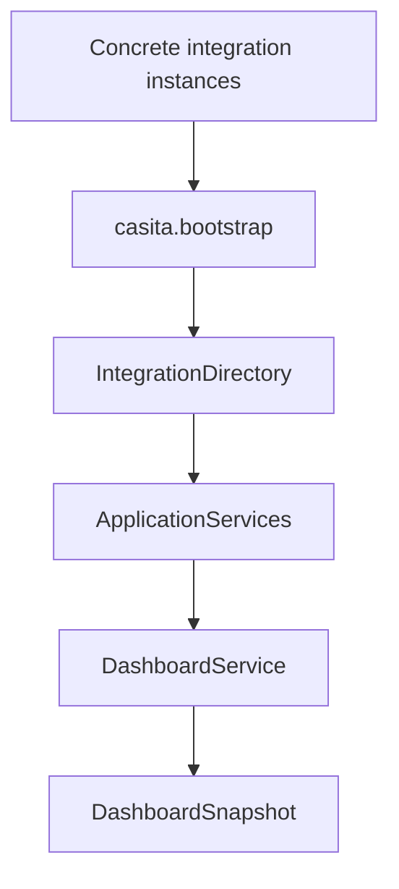

# Nuestra Casita Composition Root

## Purpose

`casita.bootstrap` is the single construction boundary for the Nuestra Casita
application. It connects concrete integration instances to backend-neutral
application services and owns the resulting object graph.

The composition root contains dependency wiring only. It does not read
household data, apply business rules, synchronize catalogs, or assemble
dashboard sections.

## Dependency Graph



Concrete adapters depend on the integration and domain contracts. The
composition root may import concrete adapters when they exist. Application
services never import or branch on an adapter implementation.

## Constructed Application

`build_application()` creates and returns a `NuestraCasitaApplication`
containing:

- One `IntegrationDirectory`
- One instance of every household capability service
- One `DashboardService`

`ApplicationServices` groups the Shopping, Inventory, Recipe, Chore,
Calendar, Budget, Notification, Device, and Media services. The dashboard
service receives those same instances rather than constructing duplicates.

The existing Grocy synchronization CLI remains intentionally separate from
the read application graph. `build_grocy_application()` constructs the Grocy
read adapter and registers its platform capabilities.

## Object Lifetime

The object graph has application scope:

1. The process entry point creates configured integration instances.
2. It calls `build_application()` once.
3. The application retains the integration directory and services for the
   process lifetime.
4. Individual dashboard snapshots and service results remain short-lived,
   immutable values.
5. Process shutdown releases the graph.

No global mutable registry, service locator, automatic package discovery, or
hidden singleton is used.

## Integration Registration

Registration is explicit:

```python
application = build_application(
    integrations=(grocy,),
    capability_owners={
        Capability.INVENTORY: ("grocy",),
        Capability.SHOPPING: ("grocy",),
    },
)
```

`build_grocy_application()` provides this production registration explicitly
for Grocy while `build_application()` remains the backend-neutral constructor.

Each adapter declares capabilities through its `IntegrationDescriptor`.
Without ownership configuration, all adapters declaring a capability
contribute in registration order. An ownership mapping can select and order
specific providers for a capability.

Adding Home Assistant, Nextcloud, Actual Budget, or Immich will require:

1. Implementing the existing integration contract.
2. Constructing the adapter at startup.
3. Adding it to the explicit `integrations` tuple.
4. Configuring ownership only where the household needs it.

No application service or dashboard assembly branch should be added.

## Startup Flow

A future executable process will:

1. Load and validate deployment configuration.
2. Construct enabled concrete adapters and their clients.
3. Call `build_application()` with adapters and capability ownership.
4. Pass the returned application to a transport such as a future REST API.
5. Resolve a household and invoke application services.

Configuration loading, secrets, authentication, persistence, network
transport, and process shutdown hooks are intentionally outside this
milestone.
