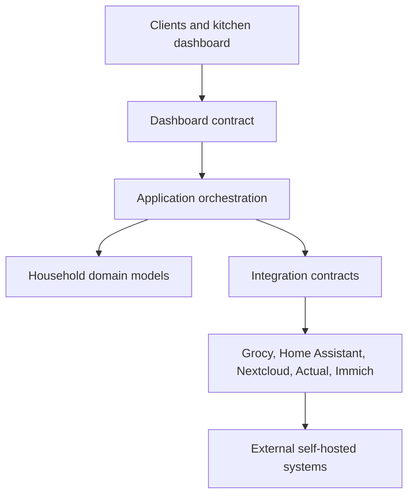

# Nuestra Casita Core Architecture

## Purpose

Nuestra Casita is the orchestration platform for a self-hosted household. It
provides a stable household language above specialized applications such as
Grocy, Home Assistant, Nextcloud, Actual Budget, and Immich.

External systems remain responsible for the workflows they implement well.
Nuestra Casita is responsible for translating their data into household
concepts, coordinating declarative synchronization, and presenting a single
internal contract to future clients.

This milestone establishes contracts only. It does not add an API server,
database, cache implementation, authentication system, dashboard, or frontend.

## Repository Audit

### Already Generic

| Component | Reusable behavior |
| --- | --- |
| Planning engine | Produces create, update, and match decisions |
| Identity matching | Supports simple names and resource-defined composite identities |
| Comparison functions | Describe field-level desired/current differences |
| Apply engine | Iterates a plan and delegates payload creation |
| Registry-driven CLI | Discovers resource commands from one registry |
| Ordered orchestration | Executes registered resources in dependency order |

### Grocy-Specific

| Component | Current coupling |
| --- | --- |
| `casita.grocy` | Grocy URL, API key, headers, and `/api` routes |
| `casita.lookups` | Grocy entity endpoints and Grocy IDs |
| Payload modules | Grocy 4.6 field names and validation rules |
| Resource definitions | Grocy endpoint names and object schemas |
| Catalog files | Declarative configuration for Grocy resources |
| Current registry | Contains only Grocy resources |
| Existing CLI text | Describes synchronization specifically with Grocy |

### Partially Generic

The synchronization and apply algorithms are generic, but they import Grocy
loaders and lookup builders directly. They should eventually move behind a
Grocy integration adapter. That migration is deliberately deferred because
rewiring proven commands would add risk without yet serving another
integration.

## Platform Layers

### Domain Layer

`casita.domain` defines backend-neutral household concepts. Domain objects may
contain `SourceReference` values for traceability, but external identifiers
never become their primary meaning.

The initial domain language includes:

- Household and Person
- Shopping List and Shopping Item
- Inventory and Inventory Item
- Recipe and Recipe Ingredient
- Chore
- Calendar Event
- Budget Summary and Money
- Notification
- Device
- Media Item

The models are immutable data contracts. They do not perform network access,
persistence, synchronization, or user-interface behavior.

### Integration Layer

`casita.integrations` defines the ports implemented by external-system
adapters.

Every integration exposes:

- A stable descriptor and capability set
- A health result
- Read operations returning only Nuestra Casita domain records

Integrations that manage Git-backed declarative configuration may additionally
implement the synchronization contract:

- Build a backend-neutral dry-run plan
- Apply the exact plan through the owning adapter
- Return an apply summary

Vendor clients, authentication, API routes, payloads, lookup IDs, pagination,
and rate limits remain inside adapters.

### Application Layer

The future application layer will:

- Select integrations by capability
- Coordinate refreshes and synchronization workflows
- Resolve ownership when multiple integrations expose the same capability
- Assemble dashboard snapshots
- Apply cache and stale-data policies
- Emit normalized notifications and platform events

No application service is implemented yet because there is no persistence,
cache, or second integration to exercise it.

### Presentation Boundary

The future kitchen dashboard consumes `DashboardSnapshot` from
`casita.dashboard`. It must not import adapter packages or receive external
API responses.

## Ownership Rules

Ownership is assigned per household capability, not globally:

- Grocy may own inventory, recipes, shopping, and chores.
- Nextcloud may own people and calendar events.
- Actual Budget may own budget summaries.
- Home Assistant may own devices and current home state.
- Immich may own selected media.
- Nuestra Casita owns normalized models, orchestration, cache policy, and the
  dashboard contract.

An integration owns communication with its backend. It does not own the
platform's domain vocabulary.

## Data Flow

### Read Projection

1. An application service requests one or more household capabilities.
2. The selected adapter retrieves backend data.
3. The adapter maps backend records to domain models.
4. The application layer validates ownership and freshness.
5. Domain records are cached or assembled into a dashboard snapshot.
6. Clients receive only the dashboard contract.

### Declarative Synchronization

1. Git-backed configuration is loaded and validated.
2. The owning integration resolves backend references.
3. The integration builds a dry-run plan.
4. A user or automation approves application.
5. The integration applies its plan through its backend client.
6. The platform records or reports the backend-neutral result.

The existing Grocy CLI already implements steps 1–5 internally. A future
adapter will translate its current plan dictionaries into the platform
`SynchronizationPlan` contract without changing Grocy payload behavior.

## Integration Boundaries

Integrations must:

- Translate external records into domain models
- Keep credentials and transport details private
- Report health and freshness explicitly
- Preserve backend-native behavior
- Distinguish declarative configuration from operational state
- Use stable source references for traceability

Integrations must not:

- Return raw vendor responses to clients
- Add vendor fields to domain models
- Make the dashboard aware of backend identifiers
- Share one backend's lookup IDs with another integration
- Assume they own capabilities that are assigned elsewhere

## Extensibility

New integrations extend the platform by implementing capabilities rather than
changing the dashboard:

1. Add an adapter package.
2. Declare its capabilities.
3. Map backend records to existing domain models.
4. Add a domain concept only when the household concept is genuinely new.
5. Register ownership in future household configuration.
6. Add synchronization support only for declarative resources.

This keeps the platform open to Paperless, MQTT, energy monitoring, vehicle
data, and other future services without exposing their APIs to clients.

## Deferred Decisions

The following intentionally remain undecided until an implementation requires
them:

- REST, GraphQL, or another client transport
- Database and migration tooling
- Cache technology
- Authentication and household authorization
- Event bus or job queue
- Integration discovery and dependency injection
- Conflict resolution between multiple writers
- Offline mutation handling
- Dashboard framework and deployment model

These are architectural decision points, not missing functionality in this
foundation milestone.
